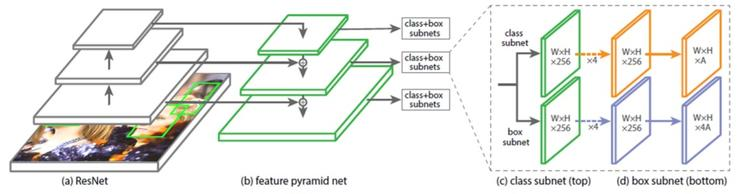
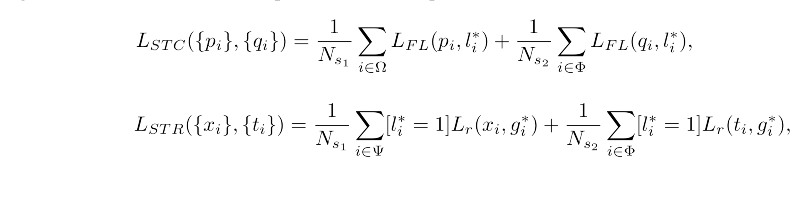
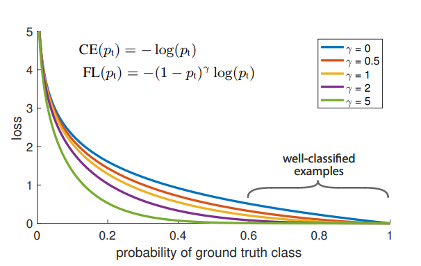
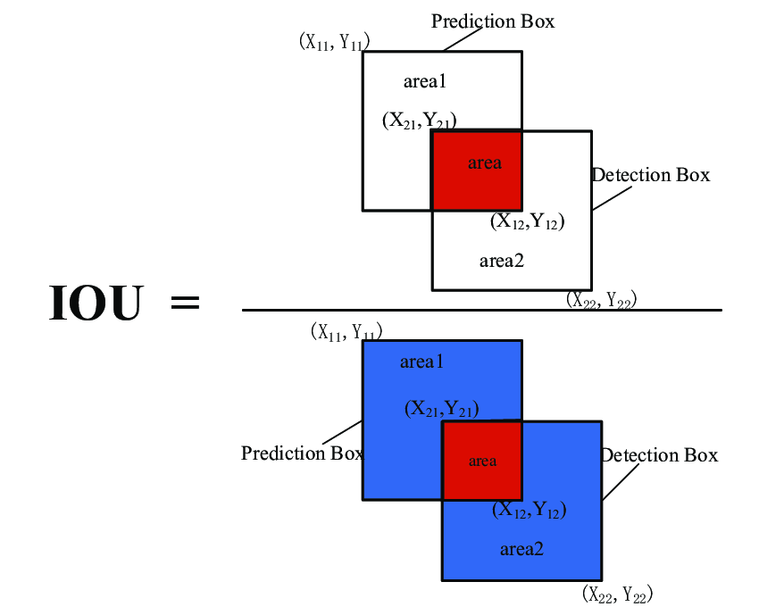

# Accurate Face Detection for High Performance

This project is implementation of computer vision model for face detection
introduced in ["Accurate Face Detection for High Performance"](https://arxiv.org/pdf/1905.01585v3.pdf)
article.

## Table of contents

* [Project layout](#project-layout)
* [Data overview](#data-overview)
* [Model details](#model-details)
* [How to run](#how-to-run)
    * [Requirements](#requirements)
    * [Dataset](#dataset)
    * [Training](#training)
    * [Evaluation](#evaluation)
* [Download](#download)


## Project layout

```
.
├── cmd               # Contains running utilities:
│   ├── train.py      # Run model training.
│   └── run.py        # Run model inference.
├── data              # Dataset directory.
├── model             # Directory containing model source code.
├── tests             # Directory containing unit tests for model source code.
├── weights           # Directory for model weights.
├── tests             # Directory containing unit tests for model source code.
├── Makefile          # Makefile with various utilities.
├── requirements.txt  # Required versions of pip packages.
└── LICENSE           # License of project.
```

## Data overview

Model is trained on one of the most popular datasets for face detection benchmark
called WIDER FACE. The dataset contains 32203 images with different scales, poses,
occlusion, face expression and illumination and has more than 390k of labeled faces.


## Model details

### Architecture



AInnoFace model consists of three parts: backbone network, feature pyramid network
and two different network heads. Main goal of backbone network is to extract features
from image and pass them to feature pyramid network. Authors of original article
use ResNet-152 layers as backbone network. Feature pyramid network is used to mix
"rich" features from the top layers of backbone network with "raw" features
from bottom layers. More details about feature pyramid network can be found
in [original article](https://arxiv.org/abs/1612.03144). Each head has its own role:
first predicts probability of patch to be foreground sample, the other predicts
shifts for an anchor box. Both heads are applied for each output level of feature pyramid
network.

### Selective refinement network

As introduced in ["Selective refinement network"](https://arxiv.org/abs/1809.02693),
two stage classification and regression are used in AInnoFace model. To improve
network predictions, we apply convolutions to "raw" backbone network output features
to obtain low-quality predictions of confidence and anchor box shifts. These
predictions are later used as a basis for second stage classification and regression
predictors. This approach changes model loss functions with adding new penalties
for the first stage:



### Loss 

Each of the heads uses its own loss function. Classifiaction head
uses Focal loss. Focal loss is modification of crossentropy loss
which penalizes high-confident predictions less. This is extremely
important for problems with high class imbalance, like it is in face
detection.



Regression head uses IoU loss between predicted bounding boxes
and ground truth bounding boxes. Intersection over union is
the most popular evaluation metric for detection problems, and here
it is directly optimized.



### Optimizer and lr scheduler

## How to run

### Dataset

### Training

### Evaluation

## Download

